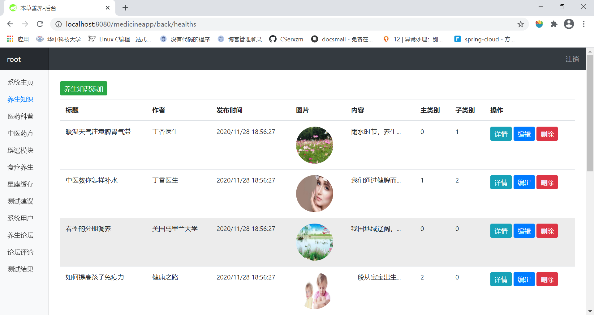
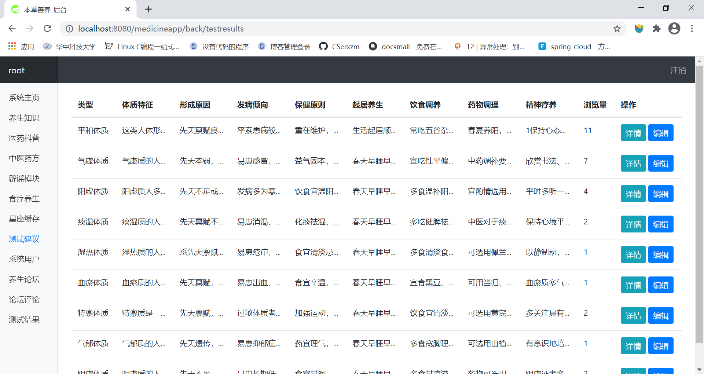
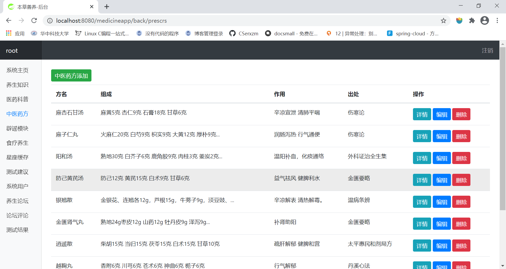

# medicineapp

##### 概述

数据表的设计见 sql/mysql.sql。

该项目为小程序提供接口，**小程序见github的其他项目，搭配使用更优**，并且提供管理员界面，只有管理员用户能够登录该用户。

项目涉及的技术springboot+mybatis+redis，前端采用bootstrap，模板引擎为theymeleaf，开发工具使用idea以及maven。

其中对于星座运势的相关信息获得，我们使用的是聚合数据提供的api，由于免费用户拉取数据次数有限，将拉去取的数据放入的redis进行缓存。

##### 运行

将sql/mysql中文件导入到数据库中，将springboot的配置文件进行修改。

```yml
spring:
  datasource:
    username: root
    password: egova #换成自己的mysql相关配置信息
    driver-class-name: com.mysql.jdbc.Driver
    url: jdbc:mysql://localhost:3306/medicineapp?useUnicode=true&characterEncoding=UTF-8&serverTimezone=CTT
  redis:
    database: 0
    host: 127.0.0.1
    port: 6379
    timeout: 3
    pool:
      minIdle: 1
      maxIdle: 10
      maxWait: 3
      maxActive: 8
    password: egovaredis # 换成自己的redis密码   
```

放入tomcat中，进行运行。

浏览器访问 `http://localhost:8080/medicineapp/` 访问，用户名为root，密码为password。

##### 效果图





